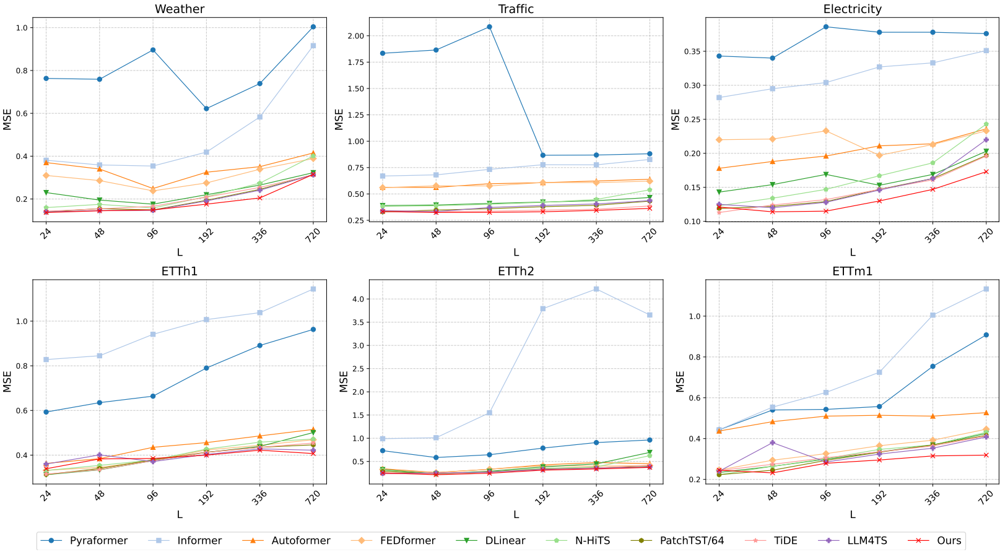
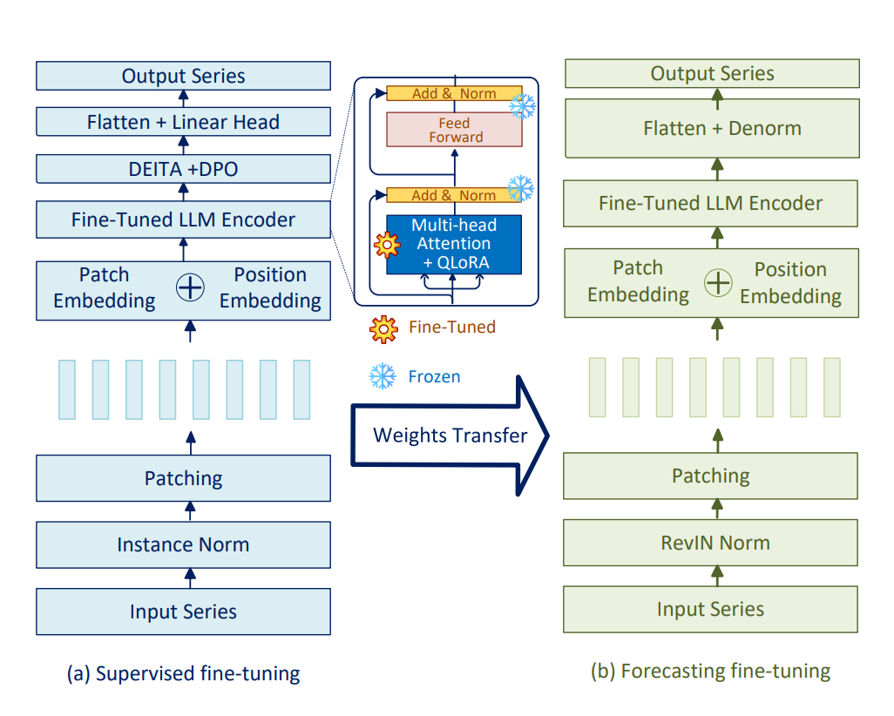
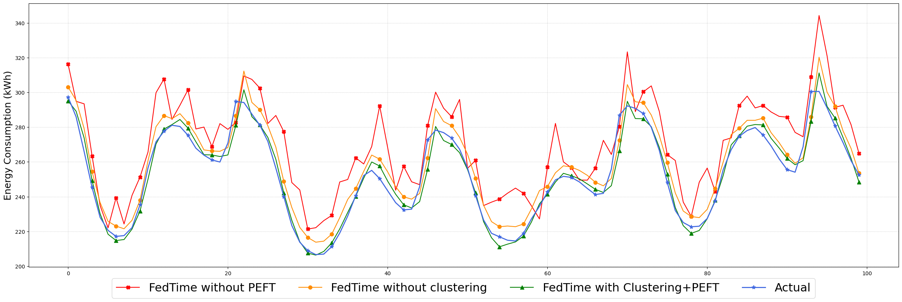
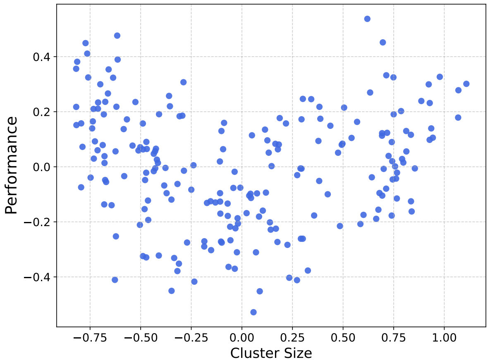
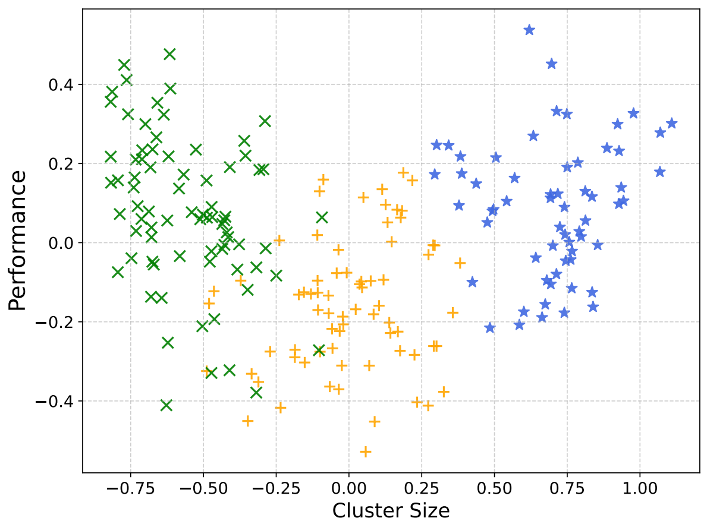
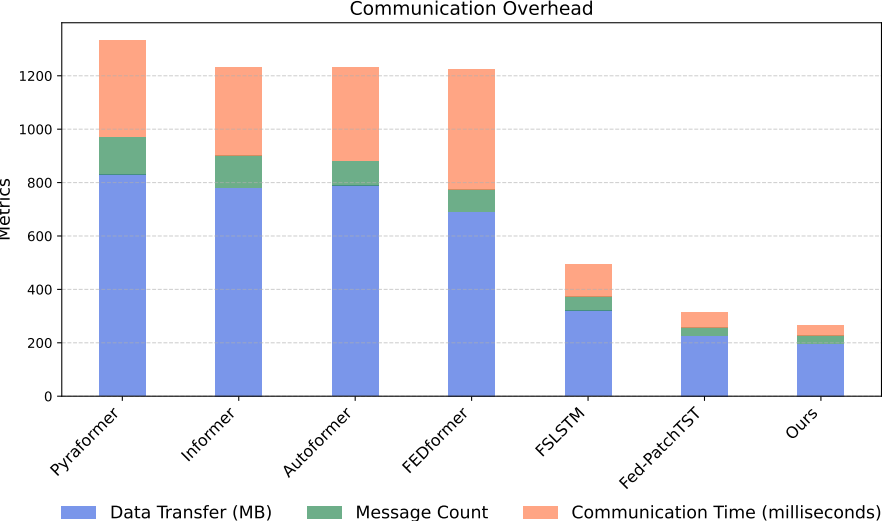

# FedTime: A Federated Large Language Model for Long-Term Time Series Forecasting

<div align="center">

[](https://openreview.net/pdf?id=ICobFdH8w2)
[](https://www.python.org/downloads/release/python-380/)
[](https://pytorch.org/)
[](https://opensource.org/licenses/MIT)

</div>

---

##  **Overview**

**FedTime** addresses critical challenges in centralized time series forecasting by introducing an **End-to-end federated learning framework** that leverages Large Language Models for **privacy-preserving**, **collaborative** time series prediction across distributed edge devices.

<div align="center">

<p><em>Figure 1: FedTime federated learning architecture with K-means clustering for EV charging stations</em></p>
</div>

###  **Key Contributions**

- **Federated LLM Framework** for time series forecasting
- 🎯 **K-means Clustering** for intelligent client grouping and focused training
- 🔧 **Parameter-Efficient Fine-tuning** (QLoRA) reducing communication by **80%**
- 📊 **Superior Performance** with up to **20% improvement** over state-of-the-art
- 🔒 **Privacy Preservation** keeping sensitive data on edge devices
- ⚡ **3× Faster Convergence** compared to centralized approaches

---

##  **Performance Highlights**

<div align="center">

<p><em>Figure 2: FedTime performance across different look-back window lengths L ∈ {24, 48, 96, 192, 336, 720}</em></p>
</div>

### 📊 **Quantitative Results**

| Dataset | Method | MSE (T=720) | MAE (T=720) | **Improvement** |
|---------|---------|:-----------:|:-----------:|:---------------:|
| **Traffic** | LLM4TS | 0.437 | 0.292 | - |
| | **FedTime** | **0.369** | **0.239** | **🔥 15.56%** ↓ |
| **Electricity** | LLM4TS | 0.220 | 0.292 | - |
| | **FedTime** | **0.176** | **0.288** | **🔥 20.0%** ↓ |
| **ETTm1** | LLM4TS | 0.408 | 0.419 | - |
| | **FedTime** | **0.328** | **0.373** | **🔥 10.98%** ↓ |

---

## 🔧 **Model Architecture**

<div align="center">

<p><em>Figure 3: FedTime two-phase fine-tuning strategy with (a) Supervised fine-tuning and (b) Forecasting fine-tuning</em></p>
</div>

### 🏗️ **Core Components**

1. **🔄 Channel Independence**: Processes each time series variable separately for better feature preservation
2. **📦 Patching Strategy**: Divides time series into patches for efficient LLM processing  
3. **🧠 LLaMA-2 Backbone**: Leverages pre-trained LLaMA-2-7B with 7B parameters
4. **⚡ QLoRA Fine-tuning**: Parameter-efficient adaptation with only **1.2% trainable parameters**
5. **🎯 Direct Preference Optimization**: Aligns model behavior with time series patterns
6. **🤝 Federated Aggregation**: Secure model update combination across clients

---

## 📈 **Experimental Validation**

### 🎯 **Ablation Study Results**

<div align="center">

<p><em>Figure 4: Ablation study showing impact of different FedTime components on Caltech EV charging data</em></p>
</div>

**Key Findings:**
- ✅ **Clustering + PEFT** provides optimal performance-efficiency trade-off
- ✅ **PEFT alone** significantly reduces communication overhead  
- ✅ **Clustering alone** improves model personalization

### 📊 **Client Clustering Analysis**

<div align="center">

| **Before Clustering** | **After Clustering** |
|:---------------------:|:-------------------:|
|  |  |

<p><em>Figure 5: K-means clustering visualization showing client distribution based on cluster size and performance metrics</em></p>
</div>

---

##  **Communication Efficiency**

<div align="center">

<p><em>Figure 6: Communication overhead comparison showing FedTime's superior efficiency</em></p>
</div>

###  **Efficiency Metrics**

- **📉 80% Reduction** in communication overhead vs. full fine-tuning
- **⚡ 3× Faster** convergence than centralized training
- **🔒 100% Privacy** preservation with local data processing
- **📱 Edge-Friendly** deployment on resource-constrained devices

---

##  **Quick Start**

### **Installation**

```bash
# Clone the repository
git clone https://github.com/Jagoul/FedTime-A-Federated-Large-Language-Model-for-Long-Term-Time-Series-Forecasting.git
cd FedTime

# Create conda environment
conda create -n fedtime python=3.8
conda activate fedtime

# Install dependencies
pip install -r requirements.txt
```

### **Dataset Preparation**

```bash
# Download benchmark datasets
bash scripts/download_datasets.sh

# Verify dataset structure
ls dataset/ETT-small/
# Expected: ETTh1.csv ETTh2.csv ETTm1.csv ETTm2.csv
```

### **Training & Evaluation**

####  **Federated Training (Recommended)**
```bash
python run_federated.py \
  --is_training 1 \
  --data ETTh1 \
  --model FedTime \
  --seq_len 96 \
  --pred_len 192 \
  --num_clients 10 \
  --num_rounds 100 \
  --local_epochs 5 \
  --use_clustering 1 \
  --num_clusters 3 \
  --use_peft 1 \
  --peft_method qlora \
  --des 'FedTime_ETTh1'
```

#### 📊 **Centralized Baseline**
```bash
python run_longExp.py \
  --is_training 1 \
  --data ETTh1 \
  --model FedTime \
  --seq_len 96 \
  --pred_len 192 \
  --des 'Centralized_ETTh1'
```

#### 🔍 **Communication Analysis**
```bash
python analyze_communication.py \
  --num_clients 10 \
  --num_rounds 100 \
  --output_dir ./communication_analysis
```

---

## 📁 **Repository Structure**

<details>
<summary><b>🗂️ Click to expand file structure</b></summary>

```
FedTime/
├── 📁 figures/                 # Paper figures and visualizations
│   ├── actual_predicted.png    # Actual vs predicted results
│   ├── communication_overhead.pdf # Communication analysis
│   ├── communication_overhead.png # Communication analysis
│   ├── Forecasting_performance.pdf # Performance comparison
│   ├── Forecasting_performance.png # Performance comparison
│   ├── with_clustering.pdf     # Clustering impact analysis
│   ├── with_clustering.png     # Clustering impact analysis
│   ├── no_clustering.pdf       # No clustering baseline
│   ├── no_clustering.png       # No clustering baseline
│   ├── FedTime_Framework.pdf   # Framework architecture
│   ├── FedTime_Framework.png   # Framework architecture
│   └── LLM_Architecture.pdf    # Model architecture details
│   └── LLM_Architecture.png    # Model architecture details
├── 📁 data_provider/                 # Dataset storage directory
│   ├── data_factory.py
│   ├── data_provider_init.py
├── 📁 exp/                     # Experiment runners
│   ├── exp_basic.py           # Base experiment class
│   └── federated_experiments.py       # Federated experiment handler
├── 📁 layers/                  # Model layers and components
│   ├── Transformer_EncDec.py  # Transformer encoder/decoder
│   ├── SelfAttention_Family.py # Attention mechanisms
│   ├── layers_init.py # Attention mechanisms
│   └── Embed.py               # Embedding layers
├── 📁 models/                  # Model implementations
│   ├── FedTime.py             # Main FedTime model
│   └── __init__.py            # Package initialization
├── 📁 scripts/                 # Training and evaluation scripts
│   ├── ablation_study_scripts.sh               # Ablation study
│   ├── analyze_communications.py  # Communication Overhead
│   ├── training_scripts.sh               # Training utilities
│   └── download_datasets.sh   # Dataset download automation
├── 📁 federated/              # Federated learning components
│   ├── federated_client.py              # Federated client implementation
│   ├── federated_server.py              # Federated server with clustering
│   ├── federated_aggregation.py         # FedAvg, FedAdam, FedOpt
│   └── clustering_component.py          # K-means clustering utilities
├── 📁 utils/                   # Utility functions
│   ├── utils_tools.py               # Training utilities and early stopping
│   ├── utils_init.py               # Training utilities to initiate the script
│   ├── utils_metrics.py             # Evaluation metrics (MSE, MAE, etc.)
│   └── utils_timefeatures.py        # Time feature engineering
├── 📁 main/                   # Core scripts
|   ├── run_longExp.py             # Main training script
|   ├── run_federated.py           # Federated training script
├── 📁 setup/                   # Experiment Setup
|   ├── requirements.txt           # Dependencies
|   └── README.md                  # This file
```

</details>

---

## 🔬 **Reproducing Paper Results**

### **Complete Experimental Suite**

```bash
# Run all benchmark experiments
bash scripts/FedTime/federated_training.sh

# Individual dataset experiments
bash scripts/FedTime/ETTh1.sh    # Electricity Transformer Temperature
bash scripts/FedTime/Weather.sh  # Meteorological data
bash scripts/FedTime/Traffic.sh  # California traffic data
bash scripts/FedTime/Electricity.sh  # Power consumption data
```

### **Comprehensive Ablation Studies**

```bash
# Component ablation
python run_federated.py --use_clustering 0 --des 'NoClustering'
python run_federated.py --use_peft 0 --des 'NoPEFT' 
python run_federated.py --use_dpo 0 --des 'NoDPO'

# Hyperparameter sensitivity
python run_federated.py --num_clusters 2 --des 'Clusters2'
python run_federated.py --num_clusters 5 --des 'Clusters5'
python run_federated.py --peft_method lora --des 'LoRA'
```

---

## 🗃️ **Supported Datasets**

| Dataset | Features | Timesteps | Granularity | Domain |
|---------|:--------:|:---------:|:-----------:|:------:|
| **ETTh1/h2** | 7 | 17,420 | 1 hour | ⚡ Energy |
| **ETTm1/m2** | 7 | 69,680 | 15 min | ⚡ Energy |
| **Weather** | 21 | 52,696 | 10 min | 🌤️ Weather |
| **Traffic** | 862 | 17,544 | 1 hour | 🚗 Transportation |
| **Electricity** | 321 | 26,304 | 1 hour | 🏠 Smart Grid |

---

## 🛠️ **Customization & Extension**

### **Adding Custom Datasets**

```python
# 1. Create data loader in data_provider/data_loader.py
class Dataset_Custom(Dataset):
    def __init__(self, root_path, data_path, flag='train', ...):
        # Your custom dataset implementation
        pass

# 2. Register in data_provider/data_factory.py
data_dict['your_dataset'] = Dataset_Custom

# 3. Run training
python run_federated.py --data your_dataset --model FedTime
```

### **Implementing New Aggregation Methods**

```python
# Add to federated/aggregation.py
class YourAggregator(FederatedAggregator):
    def aggregate(self, client_updates, client_weights, global_params):
        # Your aggregation logic
        return aggregated_params

# Use in training
python run_federated.py --aggregation_method your_method
```

---

## 📊 **Citation**

If you find FedTime useful for your research, please cite our paper:

```bibtex
@incollection{abdel2024federated,
  title={A federated large language model for long-term time series forecasting},
  author={Abdel-Sater, Raed and Ben Hamza, A},
  booktitle={ECAI 2024},
  pages={2452--2459},
  year={2024}
}
```

---

## 📄 **License**

This project is licensed under the **MIT License** - see the [LICENSE](LICENSE) file for details.

---

## 🔗 **Related Work**

| Paper | Description | Link |
|:------|:------------|:----:|
| **PatchTST** | A Time Series is Worth 64 Words | [](https://github.com/yuqinie98/PatchTST) |
| **LLaMA** | Large Language Model Meta AI | [](https://github.com/facebookresearch/llama) |
| **QLoRA** | Efficient Finetuning of Quantized LLMs | [](https://github.com/artidoro/qlora) |

---

<div align="center">

**⭐ Star this repository if you find it helpful!**

[](https://github.com/Jagoul/FedTime-A-Federated-Large-Language-Model-for-Long-Term-Time-Series-Forecasting/stargazers)
[](https://github.com/Jagoul/FedTime-A-Federated-Large-Language-Model-for-Long-Term-Time-Series-Forecasting/network/members)

---

*"Privacy-preserving collaborative intelligence for the future of time series forecasting"*
</div>
